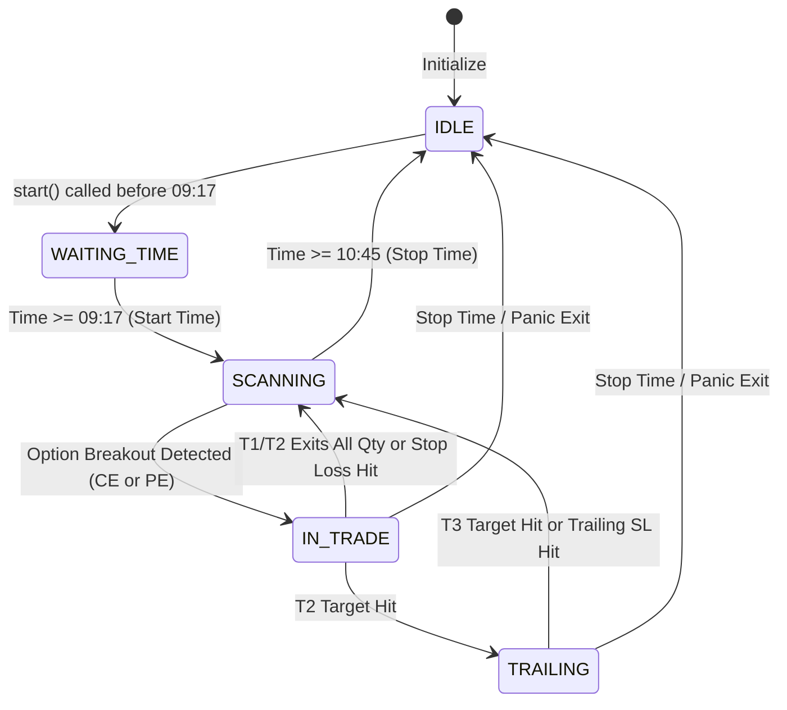
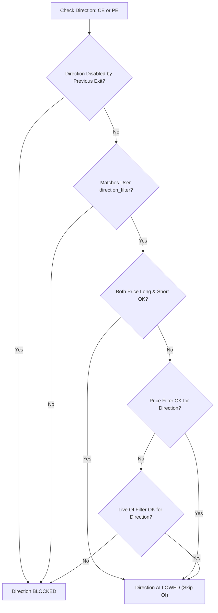
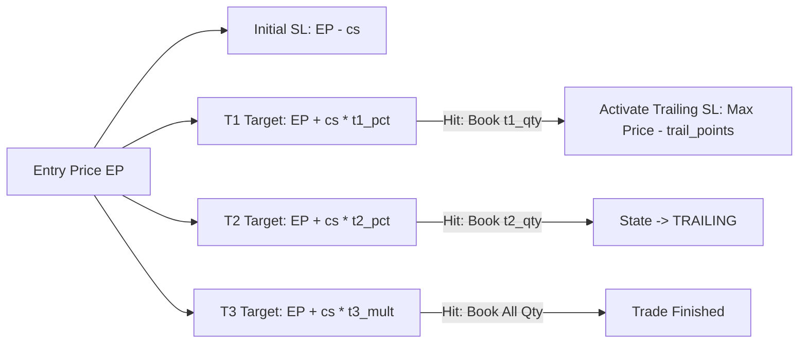

# Nifty One-Minute Options Breakout Strategy

This document provides a comprehensive technical and functional explanation of the **Nifty One-Minute Strategy (`NiftyOneMinStrategy`)** implemented in [nifty_one_min_strategy.py](file:///c:/Users/aksha/OneDrive/Documents/3%20CANDLE%20ALL%20FIX/1min_strategy%20-%20Copy/nifty_one_min_strategy.py).

---

## 1. Executive Summary & Core Concept

The **Nifty One-Minute Strategy** is an automated options breakout trading system designed for **NIFTY Index Options** (Call `CE` and Put `PE`). It operates on **1-minute OHLC time-interval candles** and aims to capture directional momentum breakouts above a designated **Reference Candle** during the morning trading session.

Key highlights of the strategy include:
- **Time-Gated Operation**: Runs between a configurable start time (default `09:17`) and stop time (default `10:45`).
- **Reference Candle Locking**: Captures the high and low of the 1-minute candle closing at the start time (`09:17`) for both Nifty Futures and the selected Option strikes.
- **Two-Layer Directional Filtering**: Combines **Price Action** (candle highs/lows at `09:16-09:17`) and **Live Open Interest (OI) Change** to permit or restrict long/short trades.
- **Multi-Stage Profit Taking (T1, T2, T3)**: Scales out position quantities at predefined target multiples of the reference option candle size.
- **Dynamic Trailing Stop-Loss**: Enforces a fixed stop loss prior to T1, then transitions to a trailing stop loss based on the maximum option price achieved since entry.
- **Anti-Whipsaw Direction Lock**: Disables re-entry in the same direction after a trade exit until an opposite-direction breakout occurs.
- **Position Flipping**: Automatically reverses positions if an opposite-direction breakout triggers while an active trade is running.

---

## 2. Strategy Lifecycle & State Machine

The strategy transitions through distinct operational states during the trading day:

### State Definitions
| State | Description |
| :--- | :--- |
| **`IDLE`** | Strategy is inactive or stopped. |
| **`WAITING_TIME`** | Strategy is started but current market time is earlier than `start_time` (default `09:17`). |
| **`SCANNING`** | Start time reached. Reference candles are set and the engine monitors live option prices for a breakout above the reference high + buffer. |
| **`IN_TRADE`** | Active trade entered in CE or PE. Monitoring for T1 / T2 targets or initial Stop Loss. |
| **`TRAILING`** | T2 target achieved. The remaining position is managed using a trailing stop loss and T3 target. |

---

## 3. Configuration Parameters

The strategy can be dynamically customized via `configure()` with the following parameters:

| Parameter | Default Value | Description |
| :--- | :---: | :--- |
| `start_time_str` | `"09:17"` | Time at which scanning starts and the **Reference Candle** is locked in. |
| `stop_time_str` | `"10:45"` | Cutoff time. No new trades are initiated after this time; idle sessions are terminated. |
| `strike_ce` / `strike_pe` | `0` | Selected Nifty Call (CE) and Put (PE) strike prices to monitor and trade. |
| `direction_filter` | `"BOTH"` | Restricts trading direction: `"BOTH"`, `"LONG"` (CE only), or `"SHORT"` (PE only). |
| `break_buffer` | `2.0` | Points above the Option Reference Candle High required to confirm a valid breakout. |
| `trail_points` | `12.0` | Trailing distance (in points) from the highest option LTP achieved since entry (activated after T1). |
| `initial_qty` | `25` | Total order quantity for initial entry. |
| `t1_qty` / `t2_qty` | `25` / `0` | Quantity to book at T1 and T2 profit targets respectively. |
| `t1_pct` / `t2_pct` | `0.5` / `1.0` | Target multipliers (as a fraction of Option Reference Candle Size) for T1 and T2. |
| `t3_mult` | `2.0` | Multiplier for the final T3 target relative to Option Reference Candle Size. |

---

## 4. Reference Candle & Time Window

1. **Designation of Reference Candle**:
   - The strategy inspects 1-minute candles closing at the configured `start_time_str` (default `09:17`).
   - The candle closing at `09:17` represents trading activity from `09:16:00` to `09:16:59`.
   - When this candle closes, the strategy saves it as:
     - `reference_candle_fut`: Nifty Futures reference candle.
     - `reference_candle_ce` & `reference_candle_pe`: The corresponding Call and Put option candles at timestamp `09:17`.
2. **Candle Size Calculation**:
   - For an option contract, the **Option Candle Size (`cs`)** is defined as:
     $$\text{Option Candle Size } (cs) = \text{Option Reference High} - \text{Option Reference Low}$$
   - If option reference data is unavailable, it defaults to the Futures reference candle size.

---

## 5. Two-Layer Filter System (Price Action & Open Interest)

Before any option breakout can trigger a trade, the strategy checks whether the direction is permitted (`_is_direction_allowed`). This combines a **static Price Filter** and a **live Open Interest (OI) Filter**:

### 1. Price Filter (`_evaluate_price_filter`)
- Evaluated **dynamically on every candle close from 09:16 onwards** against Candle 1 (`09:15–09:16`, timestamp `09:15`).
- Iterates sequentially through all closed candles after 09:15 (`09:16`, `09:17`, `09:18`, ...) in chronological order.
- **First Breakout Locks Direction Rule**:
  - The **very first candle** that breaks Candle 1's High or Low triggers the filter and **locks in** that direction for the remainder of the session:
    - **`price_long_ok`**: True if a candle breaks above `c1.high` first (locks in `price_long_ok = True`, `price_short_ok = False`).
    - **`price_short_ok`**: True if a candle breaks below `c1.low` first (locks in `price_short_ok = True`, `price_long_ok = False`).
    - **Simultaneous Breakout (Outside Bar)**: If a single candle breaks **both** `c1.high` and `c1.low` simultaneously, **both** conditions become `True`.
- **Shortcut Bypass Rule**: If **both** `price_long_ok` and `price_short_ok` become `True` (e.g. via an outside/engulfing bar), the market is deemed highly volatile/expanding; both CE and PE directions are immediately unlocked and Open Interest checks are bypassed.

### 2. Live Open Interest (OI) Filter (`_evaluate_live_oi_filter`)
- Evaluated **live on every tick** using `calculate_total_oi()` across all Option Chain strikes.
- Uses the net intraday OI change (`oi_change = current_oi - previous_close_oi`):
  - **`oi_long_ok` (Bullish Bias)**: True when $\text{Put OI Change} > \text{Call OI Change}$ (Put writers dominating).
  - **`oi_short_ok` (Bearish Bias)**: True when $\text{Call OI Change} > \text{Put OI Change}$ (Call writers dominating).

---

## 6. Breakout Detection & Position Flipping

### 1. Breakout Trigger (`_check_breakout`)
While in `SCANNING` mode, on every market tick:
- **CE Breakout (Long Signal)**:
  - `CE LTP` > `Reference CE High` + `break_buffer`
  - Previous tick CE LTP was $\le$ `Reference CE High` + `break_buffer` (ensuring a fresh crossover).
- **PE Breakout (Short Signal)**:
  - `PE LTP` > `Reference PE High` + `break_buffer`
  - Previous tick PE LTP was $\le$ `Reference PE High` + `break_buffer`.

### 2. Opposite Direction Position Flip
- If the strategy is currently `IN_TRADE` or `TRAILING` in one direction (e.g., holding **CE**) and a valid breakout occurs in the **opposite direction** (e.g., **PE** breaks out above its reference high + buffer):
  - The strategy executes an immediate **Position Flip**:
    1. Closes all remaining quantity of the current position (`_exit_all("FLIP_TO_NEW_SETUP")`).
    2. Opens a Market Buy order for `initial_qty` in the new breakout direction.

---

## 7. Trade & Risk Management

Once a trade is entered at **Entry Price ($EP$)** with Option Reference Candle Size (**$cs$**), target levels and stop losses are configured as follows:

### 1. Fixed Initial Stop Loss (Before T1)
- **Initial SL**: $EP - cs$ (Entry Price minus the option reference candle size).
- **No Trailing Before T1**: While `t1_hit == False`, the stop loss remains strictly fixed at $EP - cs$.

### 2. Multi-Stage Targets
- **Target 1 (`T1`)**: $EP + cs \times \text{t1\_pct}$ (default $0.5 \times cs$).
  - Sells `t1_qty` at Market.
  - Sets `t1_hit = True`.
  - **Activates Trailing SL**: Moves stop loss to $\max(\text{current\_sl}, \text{option\_high\_since\_entry} - \text{trail\_points})$.
- **Target 2 (`T2`)**: $EP + cs \times \text{t2\_pct}$ (default $1.0 \times cs$).
  - Sells `t2_qty` at Market.
  - Sets `t2_hit = True` and transitions strategy state to `TRAILING`.
- **Target 3 (`T3`)**: $EP + cs \times \text{t3\_mult}$ (default $2.0 \times cs$).
  - Exits all remaining position quantity (`_exit_all("T3")`).

### 3. Trailing Stop Loss (After T1)
- Once T1 is achieved, on every tick where option price hits a new high (`option_high_since_entry`), the trailing stop loss is updated:
  - **Trailing SL** = $\max$(`Current SL`, `option_high_since_entry` - `trail_points`)
- If $\text{Option LTP} \le \text{Current SL}$, all remaining quantity is exited at Market (`_exit_all("SL")`).

---

## 8. Anti-Whipsaw Direction Locking

To protect against whipsaw markets where an option repeatedly crosses above and below the breakout threshold:
- **Direction Lock**: Whenever a position is closed completely (via T1/T2 leaving zero quantity, T3 target, or Stop Loss hit), that traded direction is **disabled** (`ce_disabled = True` or `pe_disabled = True`).
- **Re-Enabling Condition**: A disabled direction is **only unlocked** when a trade is taken in the **opposite direction** (in `_enter_trade`, both `ce_disabled` and `pe_disabled` are reset to `False`).
- *Note*: A position flip (`FLIP_TO_NEW_SETUP`) does not lock the exited direction because it immediately enters the opposite setup.

---

## 9. Real-Time Data Integrity & Async Self-Healing

1. **Tick-Level Candle Building**:
   - In real-time, 1-minute OHLC candles (`running_fut_candle` and `running_opt_candle`) are constructed from incoming streaming ticks (`_update_fut_candle` and `_update_opt_candle`).
2. **Asynchronous Candle Replacement (`_async_replace_candle`)**:
   - When a 1-minute candle period closes, the locally accumulated candle is immediately stored.
   - Concurrently, a background asyncio thread (`_asyncio_thread`) queries the broker REST API (`get_time_price_series`) for the official exchange-reported 1-minute OHLC data.
   - Once retrieved, the strategy **silently replaces** the local candle with the exchange's official Open, High, Low, and Close. This guarantees that reference candle size ($cs$) and breakout thresholds remain 100% accurate even if network lag caused missed ticks.

---

## 10. Example Trade Walkthrough

1. **09:15 – 09:17 (Morning Preparation)**:
   - Strategy starts in `WAITING_TIME`.
   - At `09:17`, Candle 1 (`09:15`) and Candle 2 (`09:16`) are evaluated:
     - Suppose Candle 2 High > Candle 1 High (`price_long_ok = True`) and Candle 2 Low > Candle 1 Low (`price_short_ok = False`).
     - CE direction is enabled via Price Filter; PE direction will rely on live OI filter.
   - The `09:17` option candle for Call strike **24500 CE** closes with:
     - **High**: `120.00`, **Low**: `100.00` $\rightarrow$ **Candle Size ($cs$)**: `20.00` points.
     - **Breakout Threshold**: $120.00 + 2.0 = \mathbf{122.00}$.

2. **09:22 (Breakout & Entry)**:
   - 24500 CE LTP crosses from `121.50` to `122.50`.
   - Breakout triggered! Strategy enters **BUY 50 Qty** of 24500 CE at Market (Entry Price $EP = 122.50$).
   - **Initial SL**: $EP - cs = 122.50 - 20.00 = \mathbf{102.50}$.
   - **Targets**:
     - **T1 ($EP + 0.5 \times cs$)**: $122.50 + 10.00 = \mathbf{132.50}$.
     - **T2 ($EP + 1.0 \times cs$)**: $122.50 + 20.00 = \mathbf{142.50}$.
     - **T3 ($EP + 2.0 \times cs$)**: $122.50 + 40.00 = \mathbf{162.50}$.

3. **09:28 (T1 Target Hit & Trailing Activated)**:
   - CE LTP reaches `132.80` ($\ge 132.50$).
   - Exits **25 Qty** at Market (`t1_hit = True`).
   - Highest LTP seen = `132.80`. With `trail_points = 12.0`, Stop Loss is trailed to:
     $$\text{Trailing SL} = \max(102.50, \, 132.80 - 12.00) = \mathbf{120.80}$$

4. **09:35 (T2 Target Hit & State Change)**:
   - CE LTP reaches `143.00` ($\ge 142.50$).
   - Exits **25 Qty** (if configured) or trails remaining position; state shifts to `TRAILING`.
   - Highest LTP = `143.00` $\rightarrow$ Trailing SL moves to $143.00 - 12.00 = \mathbf{131.00}$.

5. **09:40 (Trailing Stop Hit / Exit)**:
   - Price pulls back to `130.50` ($\le 131.00$).
   - Remaining quantity is exited at Market (`_exit_all("SL")`).
   - CE direction is locked (`ce_disabled = True`) until a Put (PE) breakout occurs.
